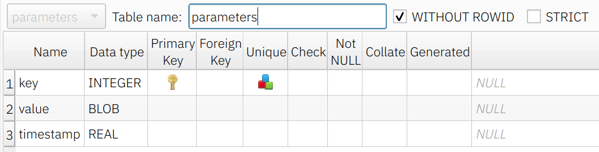

# EConfManager - Configuration Manager for Embedded Systems

## Overview

A library for managing configuration parameters in Linux-based embedded systems. Uses an SQLite database for efficient parameter sharing between multiple processes.

Features:

- Provides static C library and Rust crate interfaces
- Includes JSON RPC and REST API server with example web client
- Supports systems with read-only root filesystems (stores database in RAM with save/restore capability to the non-volatile storage)
- Implements parameter validation
- Centralised parameter definition via Protobuf file
- Real-time parameter updates across processes


Architecture

## Porting Guide

Refer to `examples/peripheral_device` for a C application example.

### 1. Define Parameters and Options

Create a `parameters.proto` file with a `message Configuration` structure. The configuration uses two layers:

1. Top-level messages in `Configuration` define parameter groups
2. Nested messages contain individual parameters

Example (see `options.proto` that contains all available options):

```protobuf
message Configuration {
    ImageAcquisition image_acquisition = 1 [
        (options.title) = "Image Acquisition",
        (options.comment) = "Image Acquisition And Camera Parameters"];

    Device device = 2 [
        (options.title) = "Device",
        (options.comment) = "Device and System Parameters"];
}
```

Parameter example with validation:

```protobuf
message ImageAcquisition {
    int32 image_width = 1 [(options.title) = "Image Width",
                           (options.validation) = RANGE,
                           (options.min) = { val_int32: 256 },
                           (options.max) = { val_int32: 2048 },
                           (options.default_value) = { val_int32: 256 },
                           (options.comment) = "The width of the processed image"];
    // ...
}
```

Current limitations (TODO):

- Repeated fields not supported

- Message-type parameters not fully implemented (will be through the `custom_types.proto`)

bytes messages (Blob, binary) can have default values that are set as `val_path` pointing to the file.

### 2. Build the Library

1. Set environment variable `PARAMETERS_PROTO_PATH` pointing to your `paramteres.proto` file

2. Build with cargo build (see `examples/peripheral_device/build.sh`)

Build process generates:

- Parameter definitions in `generated/generated.rs` containing the `PARAMETER_DATA` const array and the unique enum with the parameter IDs `ParameterId`.

- C bindings in `generated/parameter_functions.rs`

- `parameter_ids.proto` with parameter IDs

- `econfmanager.h` C header

- `libeconfmanager.a` static library

For Rust usage, see `jsonrpc_server/main.rs` example.

### 3. Use the Library from C/C++ code

Reference: `examples/peripheral_service/service.c`.

Basic workflow:

1. Initialise the library by calling `econf_init`. Provide the path to the database. The `database_path` SQLite database file can be on a RAM drive, while the `saved_database_path` SQLite database file should be located on a permanent storage.

2. Use getter and setter function like `get_device_serial_number`, `set_device_serial_number`.

3. If parameter update callbacks are required, register them with `econf_add_callback`. Each parameter can have a separate callback, but only one callback for paramter is allowed. Callbacks are called from a separate thread, but the library itself is thread-safe so the user can call getters and setters from a callback.

4. Realtime updates are implemented using multicast UDP messages. Since this is a not fully reliable transport, the app can also check for updates manually by calling `econf_update_poll` that will call the callbacks internally (in this case from the same thread). The app can also register automatic update checking by a timer by calling `econf_set_up_timer_poll`. The callbacks will be called from a timer thread in this case.

5. The parameters can be saved using `econf_save` and loaded using `econf_load`. This will use the `saved_database_path` SQLite database file.

### 4. Using the Library from Rust Code

Reference: `jsonrpc_server/main.rs`

The Rust API uses InterfaceInstance struct, providing similar functionality to the C library. Add the following to the Cargo.toml

```toml
[dependencies]
econfmanager = { git = "https://github.com/StanKarpikov/econfmanager", version = "0.1.2" }
```

And set the `PARAMETERS_PROTO_PATH` path to the Protobuf files in the `.cargo/config.toml`:

```toml
[env]
PARAMETERS_PROTO_PATH = { value = "path/to/proto", relative = true, force = false }
```

## Architecture

When a parameter is set from any of the processes that use the same database, all other processes receive an update. The database file is a regular SQLite database and can be opened with, for example, SQLiteStudio on Linux.

The database stores three columns:

- `key` is the parameter name concatenated with the group name for unique ID.
- `value` is the parameter value converted to the SQLite format.
- `timestamp` is the UNIX timestamp of the last parameter update event, this is used to get updates of the parameters.


Database Schema

Only non-default parameters are stored in the database.


Database Data

## UI Example

See `examples/web_client` for reference.

A plain JavaScript JSON-RPC client demonstrating:

- Real-time parameter updates

- Get/set interface


UI Example

## TODO

- Implement constant parameters
- Hide the private paramerers from the JSON RPC user UI
- Implement realtime updates for multiple databases with different names
